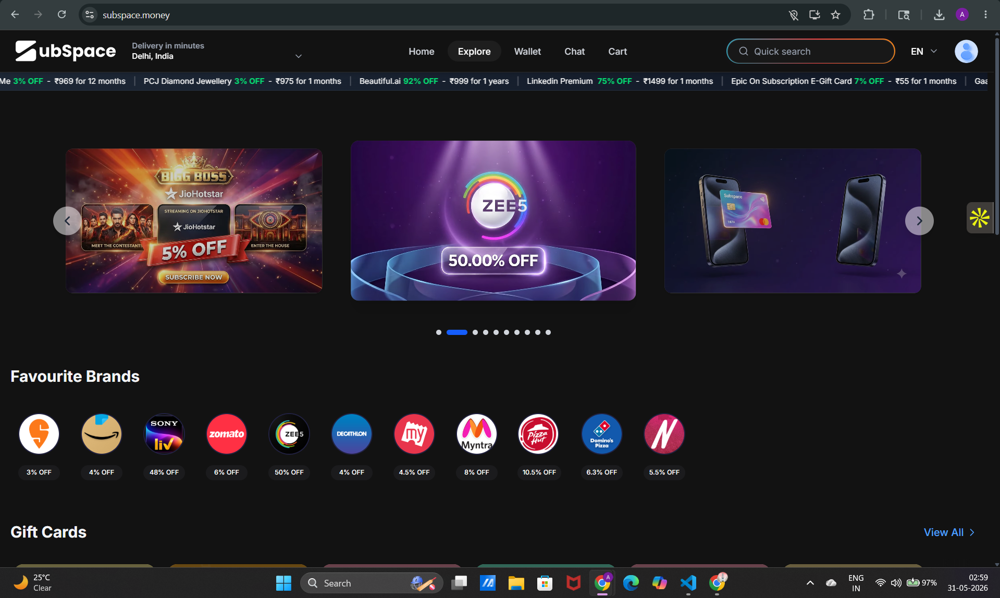
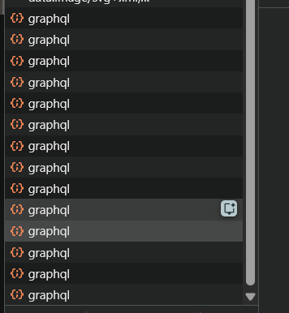
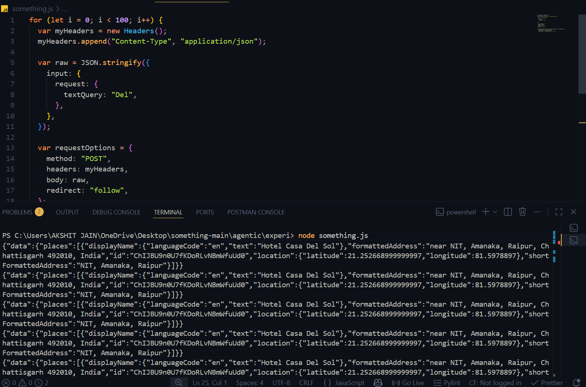
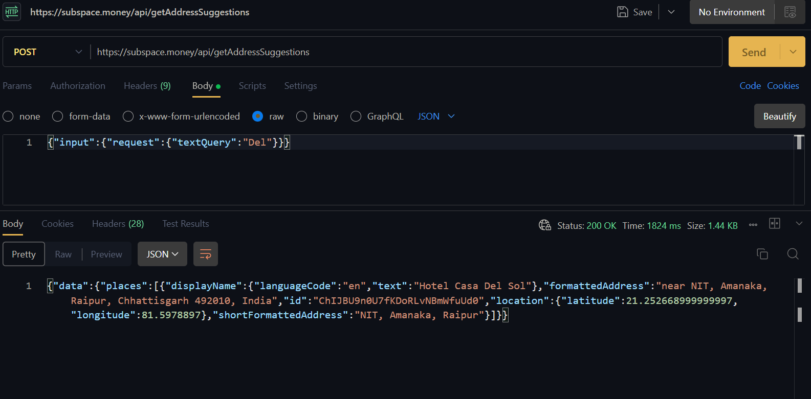
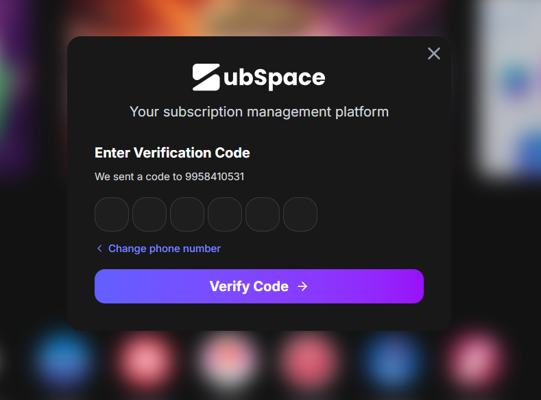
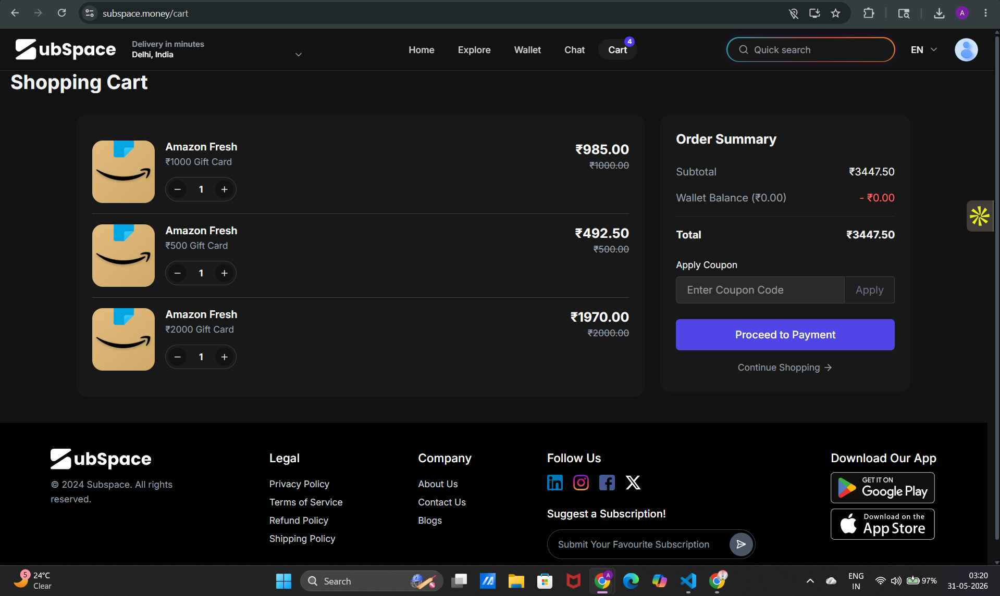
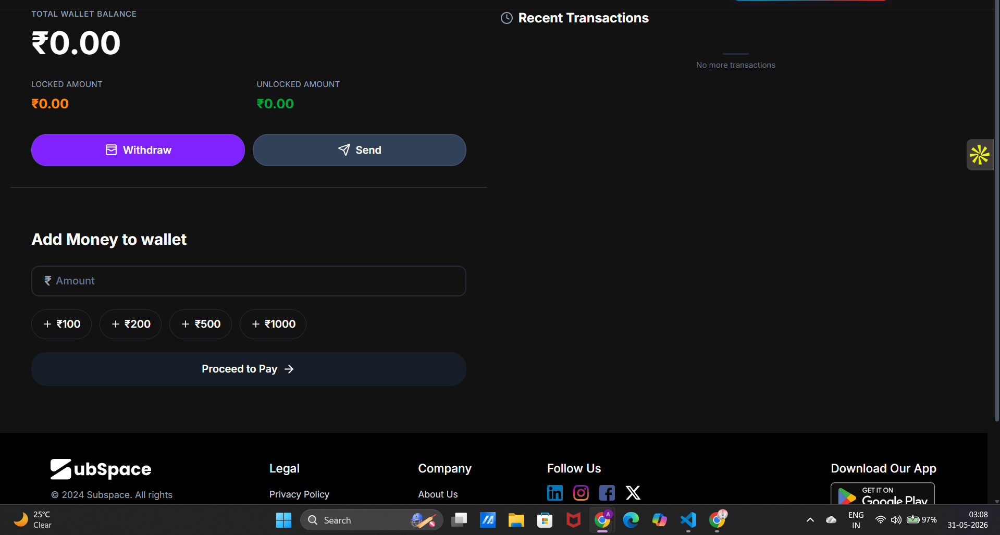
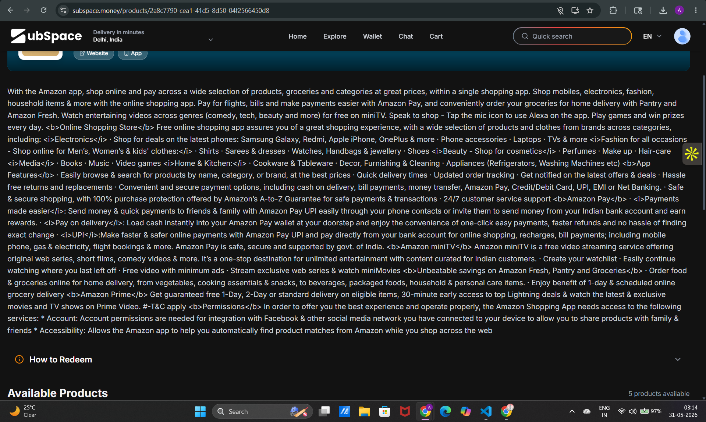

# Subspace.money — Product Teardown
**Submitted by:** Akshit Jain · MAIT Delhi, B.Tech CS (AI/ML) — 3rd Year  
**Deadline:** 31 May 2026  
**Company chosen:** Subspace.money  
**Feedbacks:** 8 total (5 product + 3 technical, hands-on)

---

## Company Snapshot

Subspace.money is a consumer fintech platform built around shared subscriptions, rentals, and gift cards. Founded in 2021 by IIT Madras alumni; bootstrapped to ₹36.5Cr ARR (FY25) with zero external funding. Joey Dash has since transitioned to Vocallabs; new CEO is Anupam Sharma.

| Metric | Value |
|---|---|
| ARR (FY25) | ₹36.5 Cr |
| Play Store Rating | 3.5★ (3.2K reviews) |
| Ops automated by AI | 90%+ |
| External funding | Zero |

## How I Used the Product

I went through subspace.money on both web and Android (app installed, walked through onboarding, subscription groups, rentals, gift card flows). I inspected the live API surface using browser DevTools and Postman — including rate-limit testing via a Node.js script and CORS header inspection. I also reviewed Play Store reviews and checked competitor positioning against CRED, PhonePe, and Paytm.

**Coverage:** Web flow · Android app · Play Store reviews · API/DevTools audit · Postman · Competitor check

## Framework

Porter's Five Forces frames Feedbacks 3 and 5 (competitive positioning and ICP strategy). The 7Ps frame Feedback 3's GTM diagnosis. Feedbacks 1, 2, and 4 are grounded in direct product observation. Feedbacks 6, 7, and 8 are grounded in a hands-on technical audit of the live API surface.

---

## Product Feedbacks — F1 through F5

---

### F1 · UX — The homepage opens with a delivery location picker, not a subscription value prop

#### (a) Observed

The very first interactive element on subspace.money is a hero prompt: *"Delivery in minutes — Select Location"* with a location picker overlay. This is the **rentals flow**. The product's own footer tagline — *"Your subscription management platform"* — directly contradicts the hero. On the app, subscription cards only appear after the user scrolls past the location-gating UI.

> **Screenshot note (web, May 2026):** Full-width location picker with "Detect my location / Search" blocking above-the-fold content before any subscription value is communicated.

#### (b) Problem

Subspace's primary moat is the subscription-sharing network effect — each member makes the group more valuable. The largest user segment (college students, early professionals) discovers Subspace because they want to split Netflix or Spotify. When they land on a location prompt, they experience cognitive dissonance: *"Is this a quick-commerce app?"*

This is a classic positioning/activation misalignment. The product's core value — *save ₹X/month on subscriptions you already pay for* — is never communicated before the first interaction asks for location permission. First-impression conversion suffers; the "aha moment" is buried.

#### (c) Ship Instead

Replace the above-the-fold hero with a **subscription savings calculator**: two-step widget — *"Which services do you pay for?"* (checkboxes: Netflix / Spotify / YouTube Premium / Canva / etc.) → *"You're paying ₹X/month. With Subspace: ₹Y/month."* CTA: *Save ₹[delta] — Join a group.*

The location/rentals flow gates only the **Rentals** tab, not the homepage. This changes the first interaction from friction (location permission) to value delivery (personalised savings estimate) — without removing the rentals feature at all.

---

### F2 · Features — Auto-detection of recurring payments exists but is not in the activation path

#### (a) Observed

The assignment brief lists *"Auto-detection & categorization of recurring payments via API"* as a Subspace feature. Yet during onboarding on both web and Android, there is no prompt to connect a bank account, upload a statement, or link UPI. The onboarding sequence is: WhatsApp/phone login → browse categories. Users must manually search for and add every subscription.

> **Screenshot note (Android, May 2026):** Phone OTP → home screen. No step to connect bank/UPI or auto-detect existing subscriptions. The "recurring payments API" capability is not surfaced to users.

#### (b) Problem

The "aha moment" for Subspace is: *you see your real subscription spend, then immediately see how much you'd save with shared groups*. That moment requires knowing what the user currently pays. If the user must manually input every service, activation drops sharply — most users won't bother after 2–3 manual entries.

The auto-detection API exists but is invisible. This is a **feature-activation gap**: a high-value capability that would dramatically reduce time-to-value is sitting unused in the product.

#### (c) Ship Instead

Make auto-detection **step 2 of onboarding**, immediately after phone verification. Two paths:

- **(A) UPI mandate scan** — pull the last 90 days of UPI autopay transactions via NPCI's recurring mandate APIs (no bank credentials needed, just UPI ID)
- **(B) Bank statement upload** — PDF/CSV upload, parse with existing pipeline

Show result: *"We found ₹1,840/month in subscriptions — here's what you'd pay on Subspace."* This collapses time-to-value from days (manual entry) to 30 seconds (auto-detected). The feature exists; it just needs to be in the critical path.

---

### F3 · GTM/ICP — Three separate business lines are diluting the network-effect moat

#### (a) Observed

The Play Store listing opens: *"one-stop destination to save money, rent anything instantly, and enjoy discounted gift cards."* The app bottom nav has five tabs: Home / Explore / Wallet / Chat / Account — no tab is named "Subscriptions." The homepage simultaneously shows shared subscription groups, rental delivery, and discounted gift card brands. The app identity shifts depending on which screen you open.

> **Screenshot note (Play Store description, April 2026):** Leads with three distinct value props in one sentence. None of the three is positioned as primary. The subscription-sharing network effect — the actual moat — is the third item mentioned.

#### (b) Problem

Using Porter's Five Forces: Subspace's **competitive advantage** is not price (gift card discounts of 6–13% can be replicated by CRED, PhonePe, Paytm in days) and not logistics (10-minute delivery needs dense dark-store networks that burn capital). The structural moat is **subscription-group stickiness**: once a group of 4 friends shares a Netflix plan, the switching cost for all four is the hassle of reforming the group elsewhere.

Gift cards and rentals generate neither this stickiness nor this network effect. They require different GTM channels, different unit economics, and different ICPs. The result: the app doesn't dominate any single search term. The acquisition message is split across three audiences who don't overlap.

#### (c) Ship Instead

Restructure the product narrative around a single ICP: *the 18–28 urban Indian who wants to pay streaming/productivity prices that match their actual usage*. Tactically:

1. Rename the app home to **Subscriptions** tab; make it the first tab
2. Rewrite the Play Store listing to lead with the network effect — *"Share any subscription with friends and pay ¼ the price"*
3. Position gift cards as a **wallet benefit** (earn 5% back on gift cards when you transact via Subspace wallet) — not a standalone product line
4. Gate rentals behind a "Subspace Plus" tier so the core app isn't perceived as a quick-commerce clone

This sharpens the ICP without shipping new code.

---

### F4 · Trust — Public groups have no trust infrastructure; payment failure is a social problem, not a structural one

#### (a) Observed

Subspace allows users to join **public groups** — shared subscription pools with strangers who become co-payers. The group admin pays upfront and is responsible for collecting from members. There is no visible payment reliability score, payment history, or pre-authorization step shown at group join. Play Store reviews mention groups *"disappearing without warning"* and members not being notified about renewal status.

> **Play Store review (April 2026, 1★, Anurag M):** *"Your groups will not be listed all of a sudden — one of the bugs they have no idea about, so no resolution."* Joey Dash's reply asks users to call a phone number — no automated resolution path exists.

#### (b) Problem

The public-group model has a structural trust gap: member A joins stranger B's group. B pays Netflix upfront and collects from A. If A doesn't pay, B takes the loss. If B is a bad actor, A loses access and money. There is no escrow, no pre-auth, no reliability score.

This is the product's most dangerous failure mode. A single bad experience — *"I paid, got kicked from the group, no refund"* — spreads virally in WhatsApp groups and kills the word-of-mouth engine that subscription-sharing apps depend on. The 3.5★ Play Store rating reflects this trust deficit.

#### (c) Ship Instead

Three structural changes, in order of implementation effort:

1. **UPI mandate pre-authorization at join.** When a user joins a public group, require a UPI AutoPay mandate for the monthly amount. Payment is held, not charged, until the admin confirms the slot is active. Eliminates the "paid and lost access" failure mode.

2. **Admin reliability score.** Display a public score on every admin profile: payment-on-time rate, months active, number of groups successfully managed. Computed automatically; no manual review needed. Members can filter public groups by admin score ≥ 4.5.

3. **Automated group-status notifications.** Push notification + in-app banner when a group is within 3 days of renewal, when an admin has not collected payment, or when a group is about to dissolve.

---

### F5 · Competitor — No B2B/team play despite the core group mechanism mapping perfectly to startup team subscriptions

#### (a) Observed

Subspace is entirely B2C-positioned. There is no "Teams" or "Business" landing page, no bulk-group pricing, no integration with procurement tools, and no outreach to startup communities — despite the existing group mechanism being a direct solution to a well-known SME pain: startup teams overpay for per-seat SaaS licenses (Canva Pro, Microsoft 365, Notion, NordVPN Teams) when family/group plans exist at 25–40% of per-seat cost.

> **Observed:** `subspace.money/teams` → 404. No LinkedIn ad targeting "startup founders". No mention of team use case in the Play Store listing or website FAQ.

#### (b) Problem

Using Porter's Five Forces, the consumer segment faces **high buyer power** (users can and do churn to CRED deals, Paytm cashbacks, or individual subscriptions). The B2B segment has structurally lower bargaining power: a founder who sets up Subspace groups for their 10-person team is extremely unlikely to churn — reforming the groups is work, and the savings are real and recurring.

By ignoring B2B, Subspace is fighting in the most competitive CAC segment (consumer fintech, same battleground as PhonePe, Paytm, CRED) while a lower-CAC, higher-LTV segment sits untouched. There are no meaningful competitors doing this — CRED is consumer-only, and enterprise SaaS procurement tools like Zluri are expensive plays that ignore SMEs.

#### (c) Ship Instead

Launch **Subspace for Teams** — a thin product layer on top of the existing group mechanism, targeted at 5–20-person startups.

**Mechanics:** One admin (founder/ops lead) creates a "Team workspace." They set up shared groups for tools like Canva, Microsoft 365, Notion, NordVPN. Members join with a company email domain — no stranger-trust issue. Billing is centralized: one monthly invoice to the admin, splittable against expense software (Zoho Expense, RazorpayX).

**Distribution:** Partner with Antler India, YC India network, NASSCOM startup programs, and Slack's India startup communities. Offer a free 3-month trial for teams under 15 people.

**Why now:** Zero new infrastructure. The group mechanism, billing, and wallet already exist. This is a GTM and positioning change, not an engineering project.

---

## Technical Audit — F6 through F8

> These three feedbacks come from directly inspecting the live product's API surface, network requests, and frontend behavior using browser DevTools, Postman, and a Node.js script.

---

### F6 · Security 🔴 CRITICAL — No rate limiting on the API; spammable with a single for-loop, no tools needed

#### (a) Observed

While exploring the web app in DevTools, I noticed every user interaction fires a `POST /graphql` request. I wrote a 25-line Node.js script with a simple `for` loop and fired 100 identical GraphQL queries in under a minute. Every single request returned **HTTP 200**. No throttling. No 429. No CAPTCHA. No ban.



*Above: The homepage and DevTools network tab showing repeated GraphQL requests being accepted without any rate-limiting response.*



*Above: DevTools showing a flood of identical GraphQL requests — all returning 200 OK within a single session, with no throttling applied.*



*Above: The Node.js script (`something.js`) that called the address suggestions API 100 times in a loop, and the terminal showing every call returning a full 200 response with no errors or rate-limit headers.*

```js
// something.js — exactly what I ran against the live endpoint
for (let i = 0; i < 100; i++) {
  var myHeaders = new Headers();
  myHeaders.append("Content-Type", "application/json");

  var raw = JSON.stringify({ input: { request: { textQuery: "Del" } } });
  var requestOptions = { method: "POST", headers: myHeaders, body: raw, redirect: "follow" };

  fetch("https://subspace.money/api/getAddressSuggestions", requestOptions)
    .then(res => res.json())
    .then(console.log);
}
// Result: 100 × HTTP 200. No rate limit hit. Total time: <60 seconds.
```

#### (b) Problem

Two distinct threat surfaces:

**1. Service disruption (DDoS).** The address suggestion endpoint is on the critical path for every user — you cannot use the rentals feature without setting a delivery location first. A bad actor running even a single-machine flood script can take down the core user flow for all active users. This is a low-skill, high-impact attack.

**2. Competitor data harvesting.** Every API call returns structured place data. A competitor can scrape Subspace's location index at zero cost — Subspace is paying for the underlying geocoding API (likely Google Places or similar) and getting nothing in return.

#### (c) Ship Instead

Three layers, in order of implementation speed:

1. **IP-based rate limiting (ship in hours).** Use an API gateway (AWS API Gateway, Cloudflare, or Nginx's `limit_req`) to cap unauthenticated requests at 10/minute per IP. Return HTTP 429 with `Retry-After` header.

2. **Session-bound tokens for authenticated requests (ship in days).** Require a short-lived JWT on every GraphQL mutation. Tokens are tied to phone-verified sessions — adds one hop of friction for any automated scraper.

3. **GraphQL query depth/complexity limits (ship in a sprint).** Use `graphql-query-complexity` to reject queries above a cost threshold — prevents single queries from fetching arbitrarily large payloads.

---

### F7 · Infrastructure 🟠 HIGH — CORS is not enforced; APIs are callable from any origin including localhost

#### (a) Observed

I called `https://subspace.money/api/getAddressSuggestions` directly from my local machine via Postman. The request succeeded with a full 200 response and a structured JSON payload containing display names, formatted addresses, and lat/lng coordinates. The response headers contain no `Access-Control-Allow-Origin` restriction to `subspace.money` — any origin is accepted.



*Above: Postman running on localhost, calling the Subspace address suggestions API directly — no auth header, no origin check — and receiving a full 200 response with structured place data including coordinates.*

#### (b) Problem

Two-sided business risk:

**1. Competitor free-riding.** Any competitor building a similar app can proxy Subspace's geocoding service at zero cost. If Subspace pays per-call for Google Places (or equivalent), a competitor scraping thousands of address lookups is directly burning Subspace's API budget.

**2. User data leakage.** APIs that return user-contextual data (group memberships, subscription status, wallet balance) without enforcing CORS + authentication could expose PII to any third-party website — a classic CSRF vector if session cookies are not configured with `SameSite=Strict`.

#### (c) Ship Instead

Three changes, each independently shippable:

1. **CORS allowlist.** Set `Access-Control-Allow-Origin: https://subspace.money` (and the app's WebView origin) on all API routes. Reject preflight requests from unlisted origins. This is a one-line config change on most API gateways.

2. **Require auth tokens on all non-public endpoints.** Gate the address suggestion API behind a session token — even an anonymous session token generated at app load. This stops external callers from reaching the endpoint without first going through the app's own auth flow.

3. **Set `SameSite=Strict; Secure; HttpOnly` on all session cookies.** Prevents CSRF attacks that depend on cookies being included in cross-origin requests.

---

### F8 · UX Bugs 🟡 MEDIUM — Three observed frontend bugs: OTP layout, cart badge stale state, wallet page rendering failure

#### (a) Observed

Three distinct bugs observed in the same session:

---

**Bug 1 — OTP screen layout misalignment**

The "Enter Verification Code" modal is left-aligned on a wide viewport. The OTP input section title sits flush-left while the modal itself is centered — visually abrupt and jarring. On a wide screen the left and right padding becomes excessively wide, stretching the UI and creating an uncomfortable reading span for the user.



*Above: The OTP verification modal on web. The title "Enter Verification Code" is left-aligned inside a centered modal, and the extreme side whitespace makes the entire screen feel stretched and unfinished.*

---

**Bug 2 — Cart badge not updating (Redux state issue)**

I added 4 items to the cart and then removed one. The cart count badge in the top navigation bar continued to show the old count — it did not decrement. The cart page itself showed the correct 3-item count, but the nav badge was stale. This is a classic Redux store / derived-state sync failure — the badge is likely reading from a selector that is not subscribed to the correct slice of state.



*Above: The shopping cart page correctly shows 3 items after one was removed, but the "Cart" badge in the top navigation still shows the old count — a Redux state sync bug where the badge counter is not derived from the actual items array.*

---

**Bug 3 — Wallet page HTML rendering failure + layout issues**

The wallet page displays raw HTML tags visible in the UI — content that should be rendered as formatted text is instead showing as literal markup. Additionally, the "Recent Transactions" section sits to the right of the main wallet balance area as a two-column layout when it should stack below. The preset top-up amount chips show ₹100 / ₹200 / ₹500 / ₹1000 — skipping ₹2000 and ₹5000.



*Above: The wallet page with three issues visible — raw HTML tags rendered as literal text on-screen, the "Recent Transactions" panel floating to the right creating a stretched two-column layout, and the top-up presets missing ₹2000 and ₹5000 denomination chips.*



*Above: A product/gift card page on Subspace showing raw HTML markup visible in the description body — bold tags, list tags, and anchor tags all rendered as literal text instead of formatted content.*

#### (b) Problem

Individually, these are polish issues. Collectively, they signal the web app does not have systematic QA coverage. For a fintech product, visible rendering bugs on the wallet page are particularly damaging — users equate UI polish with financial trustworthiness. A broken wallet page in a payments app is the UX equivalent of a torn note: technically valid, but nobody wants it.

The Redux cart-badge bug specifically undermines the gift-card and subscription checkout flows — if the count is wrong before checkout, users lose confidence in the cart state and may abandon.

#### (c) Ship Instead

Bug-by-bug fixes, each independently shippable in under a day:

**Bug 1 — OTP layout:** Center-align the modal title and constrain the modal `max-width` to ~420px with `margin: 0 auto`. Add `text-align: center` to the verification code header. Two CSS lines.

**Bug 2 — Cart badge (Redux fix):** The nav badge selector should derive from `cart.items.length` (or equivalent), **not** from a separately maintained `cart.count` integer that is only incremented on add and not decremented on remove. Fix the selector to compute from the items array directly — this guarantees the badge is always in sync with actual cart state.

**Bug 3 — Wallet page:**
- Audit all server-rendered content fields and ensure they pass through a sanitization layer (DOMPurify or equivalent) before rendering
- Move "Recent Transactions" below the main balance widget in a single-column layout; add it as a bottom-sheet on mobile
- Update top-up presets to: **₹100 / ₹500 / ₹1000 / ₹2000 / ₹5000** — aligning with standard UPI denomination conventions

---

## Priority Matrix

| Rank | Feedback | Pillar | Impact | Effort | Sequence |
|---|---|---|---|---|---|
| 🚨 | API rate limiting (GraphQL + address endpoint) | Security | ●●●●● | ● | **Urgent — live vulnerability today** |
| 🚨 | CORS enforcement + session cookie flags | Infrastructure | ●●●●○ | ● | **Urgent — one config change on API gateway** |
| 1 | UPI mandate pre-auth for public groups | Trust | ●●●●● | ●● | Ship first (product) — blocks churn & negative WOM |
| 2 | Auto-detection in onboarding (UPI mandate scan) | Feature | ●●●●○ | ●●● | Directly improves activation rate |
| 3 | Homepage hero → savings calculator | UX | ●●●○○ | ● | Low effort, high conversion upside — quick win |
| 4 | Frontend bugs: cart badge + wallet HTML + OTP | UX Bugs | ●●●○○ | ● | Each bug is a <1 day fix; high trust ROI |
| 5 | Subspace for Teams (B2B play) | Competitor | ●●●●○ | ●● | GTM + positioning change, minimal eng needed |
| 6 | Subscription-first narrative restructure | GTM/ICP | ●●●○○ | ● | Pure copy/positioning work — no code required |

---

## One-Line Summary Per Feedback

| # | Feedback | One-liner |
|---|---|---|
| F1 | UX | Don't lead with a location picker when your moat is subscription savings. |
| F2 | Feature | The auto-detection API exists — it just needs to be in the critical onboarding path. |
| F3 | GTM/ICP | Three products with three ICPs = no dominant position in any of them. |
| F4 | Trust | Stranger-group payments fail socially; make them fail structurally instead (via UPI pre-auth). |
| F5 | Competitor | The startup-team subscription play is uncontested, and Subspace's existing infra is built for it. |
| F6 | Security | A 25-line for-loop can take down the address endpoint — fix this before anything else. |
| F7 | CORS/API | APIs callable from localhost means competitors get your geocoding for free and your users' data is at risk. |
| F8 | UX Bugs | A wallet page that renders raw HTML in a fintech app is a trust emergency, not a polish backlog item. |

---

*Subspace.money Product Teardown · Akshit Jain · MAIT Delhi*  
*Submitted: 31 May 2026 · [github.com/Aj242005](https://github.com/Aj242005) · [linkedin.com/in/akshitjain24](https://linkedin.com/in/akshitjain24)*
